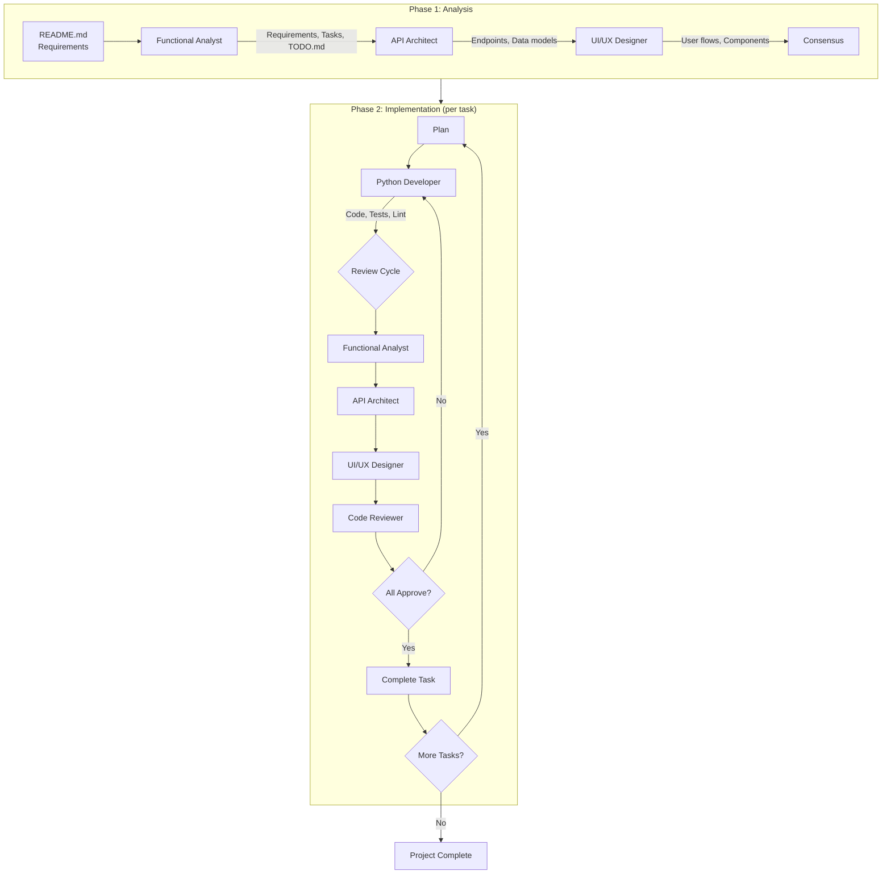

# Claude Code Configuration Harness

A collection of reusable skills, agents, and settings for Claude Code to support structured Python/Baseweb development workflows.

## What's This?

This repository provides a configuration harness that enhances Claude Code with:

- **Skills** — Specialized guidance invoked via `/skill-name`
- **Agents** — Domain-specialized subagents for structured development
- **Settings** — Pre-configured permissions and status line

Once installed, these become available across all your Claude Code projects.

## Quick Start

```bash
# Clone and install
git clone https://github.com/christophevg/c3.git
cd c3
make install
```

This symlinks the configuration into `~/.claude/`, making it available to Claude Code.

## Components

### Skills

Skills provide focused guidance for specific technologies and workflows:

| Skill | Command | Purpose |
|-------|---------|---------|
| Python | `/python` | Python coding standards and testing patterns |
| Database | `/database` | MongoDB access patterns and security best practices |
| Baseweb | `/baseweb` | Baseweb/Vue/Vuetify frontend and backend patterns |
| Fire | `/fire` | Python Fire CLI patterns |
| Manage Project | `/manage-project` | Orchestrates multi-agent project workflow |
| Start Baseweb | `/start-baseweb-project` | Bootstrap new Baseweb projects |
| Analysis Integration | `/analysis-integration` | Consolidate findings from domain agents |
| Lessons Learned | `/lessons-learned` | Review session for improvements |
| Transcribe Session | `/transcribe-session` | Create curated session transcripts |

### Agents

Agents are specialized subagents that handle specific aspects of development:

| Agent | Role |
|-------|------|
| **Functional Analyst** | Translates requirements into tasks, maintains TODO.md |
| **API Architect** | Designs RESTful APIs and data models |
| **UI/UX Designer** | Designs user interfaces and user flows |
| **Python Developer** | Implements code following project conventions |
| **Code Reviewer** | Reviews code for quality and best practices |

## Project Management Workflow

The `/manage-project` skill orchestrates a structured development workflow using multiple specialized agents:



## File Structure

```
c3/
├── agents/
│   ├── api-architect.md      # API design agent
│   ├── code-reviewer.md      # Code review agent
│   ├── functional-analyst.md # Requirements analysis agent
│   ├── python-developer.md   # Implementation agent
│   └── ui-ux-designer.md     # UI/UX design agent
├── skills/
│   ├── analysis-integration/ # Consolidate multi-agent findings
│   ├── baseweb/              # Baseweb/Vue/Vuetify patterns
│   ├── database/             # MongoDB patterns
│   ├── fire/                 # Python Fire CLI patterns
│   ├── lessons-learned/      # Session review skill
│   ├── manage-project/       # Project workflow orchestration
│   ├── python/               # Python best practices
│   ├── start-baseweb-project/# Project bootstrapping
│   └── transcribe-session/   # Session transcription
├── bin/
│   └── statusline.py         # Context display script
├── settings.json             # Claude Code configuration
├── Makefile                  # Installation commands
└── CLAUDE.md                 # Project guidance
```

## Key Conventions

### Indentation
Always use **two spaces** for indentation in all file types.

### Testing
```python
class TestMyFeature:
  @pytest.fixture(autouse=True)
  def setup_env(self, monkeypatch):
    monkeypatch.setenv("MY_VAR", "value")
    self.mock_service = MagicMock()
    yield

  def test_success_case(self):
    # Test implementation
    pass
```

### Error Handling
```python
try:
  result = get_item(item_id)
except NotFoundError:
  raise  # Re-raise domain exceptions
except PyMongoError as e:
  logger.error(f"Database error: {e}\n{traceback.format_exc()}")
  raise DatabaseError(f"Failed: {e}")
```

## Status Line

The status line displays real-time context information:

```
Claude Sonnet: ████████░░ 80% | ⏱️ 5m 32s | 45%/12%
🐍 3.11 | 🌿 feature-branch
```

## Extending

Add new skills by creating a `SKILL.md` in a subdirectory of `skills/`:

```markdown
---
name: my-skill
description: What this skill does
---

# Skill Title

Guidance content...
```

Add new agents by creating an agent file in `agents/`:

```markdown
---
name: my-agent
description: What this agent does
tools: Read, Glob, Grep, Write, Edit
color: blue
---

# Agent Title

Instructions...
```