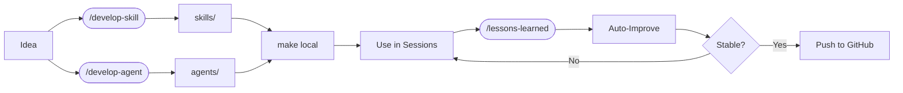
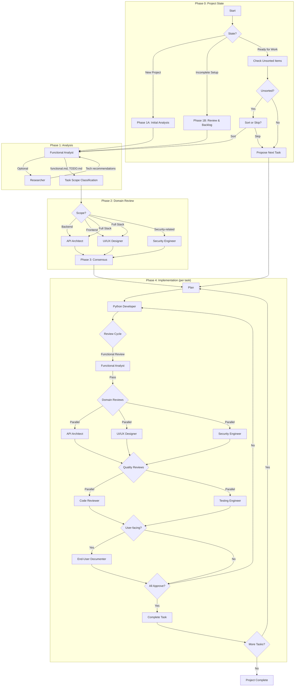

# C3 - Christophe's Coding Crew

[][platform]
[][license]

> A personal collection of skills and agents for agentic coding and other stuff.

## Disclaimer

> ⚠️ **Before installing any plugin**: Plugins can execute arbitrary commands on your machine. Always review a plugin's code before installing it.
>
> This is **my personal collection**. It is in constant flux. I try to keep the plugin version stable and usable, but **YMMV** 😇

---

## Philosophy

The agentic workflow is built on a simple belief: **create small automation steps, use them, and iteratively improve**. Each skill and agent emerged from real needs, was refined through use, and continues to evolve.

### The Skill Evolution Cycle



- **Create**: Use `/develop-skill` or `/develop-agent` to design new skills/agents
- **Test locally**: `make local` runs with `--plugin-dir ./`
- **Use/Refine loop**: Use in sessions, run `/lessons-learned` to capture improvements
- **Distribute**: Push to GitHub when stable

---

## Installation

### As a Plugin (End Users)

Install from the christophe.vg marketplace:

```bash
# Add the marketplace
claude plugin marketplace add christophevg/marketplace

# Install C3
claude plugin install c3@christophe.vg
```

Skills and agents are namespaced (e.g., `/c3:python`, `/c3:commit`).

### Local Development

To develop or test the latest version locally:

```bash
# Clone the repository
git clone https://github.com/christophevg/c3.git
cd c3

# Test locally (overrides installed plugin)
make local
```

The `make local` target runs Claude with `--plugin-dir ./` to test unreleased changes.

---

## Skills (38)

Skills provide focused guidance for specific technologies and workflows.

### Plugin & MCP Development (2)

| Skill | Description |
|-------|-------------|
| `/mcp-server` | Guide for designing and building MCP servers (FastMCP, security, deployment). |
| `/plugin-development` | Guide for creating Claude Code plugins (structure, manifest, distribution). |

### Project Management (4)

| Skill | Description |
|-------|-------------|
| `/project` | Dispatcher for project management skills. |
| `/project-feature` | Capture and scope new features. |
| `/project-manage` | Full implementation workflow with specialized agents. |
| `/project-status` | Show current project status snapshot. |

### Personal Assistant (4)

| Skill | Description |
|-------|-------------|
| `/pa` | Main dispatcher for personal assistant workflow. |
| `/pa-inbox` | Process inbox files into actionable TODOs. |
| `/pa-session` | Manage session state for workflow continuity. |
| `/pa-outbox` | Generate formatted replies and manage archive. |

### Domain Expertise (6)

| Skill | Description |
|-------|-------------|
| `/python` | Python coding standards and testing patterns. |
| `/pymongo` | MongoDB/PyMongo patterns and security. |
| `/baseweb` | Baseweb/Vue/Vuetify best practices. |
| `/fire` | Python Fire CLI patterns. |
| `/textual` | Textual TUI framework. |
| `/rich` | Rich console output. |

### Development (2)

| Skill | Description |
|-------|-------------|
| `/develop-skill` | Create and refine Claude Code skills. |
| `/develop-agent` | Develop Claude Code agents. |

### Utility (20)

| Skill | Description |
|-------|-------------|
| `/commit` | Git commits with atomic commits and conventional format. |
| `/bug-fixing` | Systematic bug fixing with TDD. |
| `/git-activity-report` | Human-readable git activity summaries. |
| `/git-scripting` | Safe git command usage in scripts. |
| `/naming` | Choose names for projects, products, agents. |
| `/analysis-integration` | Integrate findings from multiple agents. |
| `/lessons-learned` | Review session to improve skills/agents. |
| `/documentation` | Sphinx/readthedocs setup. |
| `/markdown-to-pdf` | Convert Markdown to PDF with TOC. |
| `/readme` | Create and maintain README files. |
| `/transcribe-session` | Curated session transcripts. |
| `/api2mod` | Convert API docs to Python modules. |
| `/spec2mod` | Generate Python from OpenAPI specs. |
| `/start-baseweb-project` | Start new Baseweb projects. |
| `/vue-form-generator` | Schema-based Vue.js forms. |
| `/vuetify-v1` | Vuetify 1.5 components. |
| `/vuetify-v2` | Vuetify V2 components. |
| `/ollama` | Python ollama library for LLM integration. |
| `/pyenv` | Manage Python versions. |
| `/pypi-publish` | Publish packages to PyPI. |

---

## Agents (11)

| Agent | Description |
|-------|-------------|
| `assistant` | Personal assistant for inbox processing. |
| `functional-analyst` | Requirements extraction and task planning. |
| `researcher` | Comprehensive research with provenance. |
| `api-architect` | API design and architecture. |
| `ui-ux-designer` | User experience and interface design. |
| `python-developer` | Python implementation. |
| `code-reviewer` | Code quality review. |
| `testing-engineer` | Test planning and coverage. |
| `security-engineer` | Security vulnerability assessment. |
| `end-user-documenter` | Documentation generation. |
| `knowledge-agent` | Knowledge base querying and evolution. |

---

## Project Management Workflow



---

## Contributing

See [CONTRIBUTING.md](CONTRIBUTING.md) for guidelines.

## License

[MIT](LICENSE)

[platform]: #
[license]: LICENSE