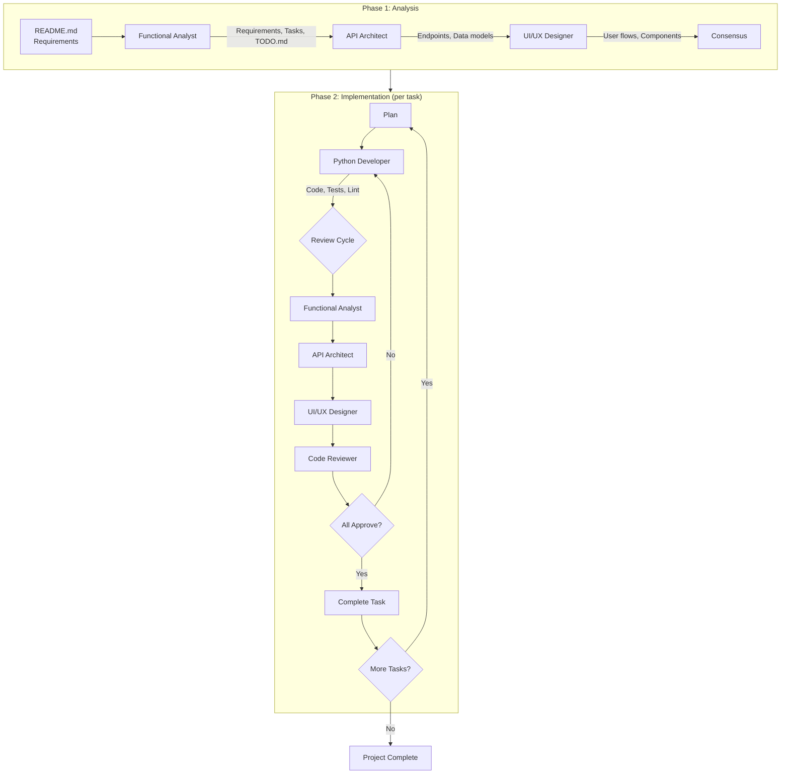

# C3 - Claude Code Configuration Harness

A reusable collection of skills, agents, and settings for Python/Baseweb development projects. Designed to be symlinked into `~/.claude/` for use across multiple projects.

## Quick Start

```bash
# Clone and install
git clone https://github.com/christophevg/c3.git
cd c3
make install
```

This symlinks `agents/`, `skills/`, `bin/`, and `settings.json` into `~/.claude/`.

---

## Skills (29)

Skills provide focused guidance for specific technologies and workflows. Invoked via `/skill-name`.

### Project Management (4)

| Skill | Description |
|-------|-------------|
| `/project` | Dispatcher for project management skills. Routes to appropriate project-* skill based on intent. |
| `/project-feature` | Capture and scope new features for a project. Handles minimal or detailed descriptions. |
| `/project-manage` | Manage the entire project workflow, orchestrating specialized agents for analysis, design, implementation, and review. |
| `/project-status` | Show current project status snapshot. Reads TODO.md, analysis/, and reporting/. |

### Domain Expertise (6)

| Skill | Description |
|-------|-------------|
| `/python` | Python coding standards and testing patterns. |
| `/database` | MongoDB access code patterns and security. |
| `/baseweb` | Baseweb/Vue/Vuetify best practices. |
| `/fire` | Python Fire CLI patterns. |
| `/textual` | Textual TUI framework for building terminal user interfaces with CSS styling and reactive state. |
| `/rich` | Rich console output with styled text, tables, progress bars, and logging. |

### Development (2)

| Skill | Description |
|-------|-------------|
| `/develop-skill` | Guide creation and refinement of Claude Code skills. Context-aware workflow for incubator vs operational. |
| `/develop-agent` | Develop new Claude Code agents from description to working agent. |

### Utility (17)

#### Git & Workflow

| Skill | Description |
|-------|-------------|
| `/commit` | Guide git commit operations with atomic commits and conventional format. |
| `/bug-fixing` | Systematic bug fixing with TDD approach. Coordinates analyst/reviewer agents. |
| `/git-activity-report` | Generate human-readable git activity summaries focused on accomplishments. |
| `/git-scripting` | Guide safe git command usage in scripts, Makefiles, and automation. |
| `/naming` | Guides choosing a name for a project, product, agent, or entity. |

#### Analysis & Review

| Skill | Description |
|-------|-------------|
| `/analysis-integration` | Integrate findings from multiple domain agents and update backlog coherently. |
| `/lessons-learned` | Review session to improve existing skills/agents or create new ones. |
| `/plan-review` | Review cross-project priorities and manage master PLAN.md. |

#### Documentation

| Skill | Description |
|-------|-------------|
| `/documentation` | Set up or update project documentation for Sphinx/readthedocs.org. |
| `/markdown-to-pdf` | Convert folders of Markdown files to a single PDF with table of contents. |
| `/transcribe-session` | Create curated transcript of the current or recent session. |

#### API & Code Generation

| Skill | Description |
|-------|-------------|
| `/api2mod` | Convert API documentation into Python modules. Orchestrates doc2spec and spec2mod. |
| `/spec2mod` | Generate Python module from OpenAPI/Swagger/Postman spec. |

#### Project Setup

| Skill | Description |
|-------|-------------|
| `/start-baseweb-project` | Start a new Baseweb-based project. |
| `/vue-form-generator` | Create complex, schema-based forms in Vue.js applications. |
| `/vuetify-v1` | Create or modify Vuetify 1.5 UI components in legacy Baseweb projects. |
| `/vuetify-v2` | Create or modify Vuetify V2 UI components in Baseweb projects. |

#### Other

| Skill | Description |
|-------|-------------|
| `/ollama` | Guide Python ollama library for LLM integration including chat, tool calling, streaming, embeddings. |
| `/pyenv` | Manage Python versions and virtual environments with PyEnv. |

---

## Agents (9)

Specialized agents for structured project development.

### Analysis

| Agent | Description |
|-------|-------------|
| `functional-analyst` | Reviews features & tasks, extracts requirements, clarifies requirements and creates ordered actions. |
| `researcher` | Researches topics comprehensively with full provenance tracking. |
| `api-architect` | Specialist in designing clean, efficient, and well-structured APIs. |

### Design

| Agent | Description |
|-------|-------------|
| `ui-ux-designer` | Focuses on user experience, creating intuitive, accessible, and aesthetically pleasing interfaces. |

### Implementation

| Agent | Description |
|-------|-------------|
| `python-developer` | Implements Python code following project conventions, best practices, and instructions. |

### Review

| Agent | Description |
|-------|-------------|
| `code-reviewer` | Reviews code for quality and best practices. Provides structured review documents. |
| `testing-engineer` | Independent test planning and functionality coverage analysis. |
| `security-engineer` | Security specialist for vulnerability assessment and architecture recommendations. |

### Documentation

| Agent | Description |
|-------|-------------|
| `end-user-documenter` | Produces comprehensive end-user documentation as static HTML site and PDF. |

---

## Project Management Workflow

The `/project` dispatcher orchestrates a structured development workflow:



---

## File Structure

```
c3/
├── agents/           # Specialized agent definitions
├── skills/           # Reusable skill definitions
├── bin/              # Utility scripts (statusline)
├── settings.json     # Claude Code configuration
├── CLAUDE.md         # Project guidance for Claude
├── README.md         # This file
└── Makefile          # Installation commands
```

---

## Key Conventions

### Indentation
Always use **two spaces** for indentation in all file types.

### Testing
```python
class TestMyFeature:
  @pytest.fixture(autouse=True)
  def setup_env(self, monkeypatch):
    monkeypatch.setenv("MY_VAR", "value")
    self.mock_service = MagicMock()
    yield

  def test_success_case(self):
    # Test implementation
    pass
```

### Error Handling
```python
try:
  result = get_item(item_id)
except NotFoundError:
  raise  # Re-raise domain exceptions
except PyMongoError as e:
  logger.error(f"Database error: {e}\n{traceback.format_exc()}")
  raise DatabaseError(f"Failed: {e}")
```

---

## Status Line

The status line displays real-time context information:

```
Claude Sonnet: ████████░░ 80% | ⏱️ 5m 32s | 45%/12%
🐍 3.11 | 🌿 feature-branch
```

---

## Extending

Add new skills by creating a `SKILL.md` in a subdirectory of `skills/`:

```markdown
---
name: my-skill
description: What this skill does. Use when X happens. Examples: "do X", "help with Y".
---

# Skill Title

Guidance content...
```

Add new agents by creating an agent file in `agents/`:

```markdown
---
name: my-agent
description: What this agent does
tools: Read, Glob, Grep, Write, Edit
color: blue
---

# Agent Title

Instructions...
```

---

## Updating This Catalog

This catalog is generated from SKILL.md and agent frontmatter. When adding or modifying skills/agents, the develop-skill workflow includes updating this catalog.