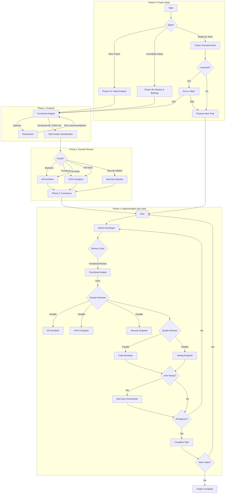

# C3 - Christophe's Coding Crew

[][platform]
[][license]

> A personal collection of skills and agents for agentic coding and other stuff. 

When I finally had the time to explore the agentic world, I entered a realm that I absolutely adore. I’ve always been fascinated by automation and workflow structuring, and working in an agentic context aligns perfectly with these interests. It’s primarily about developing skills, training agents, and refining their behavior.

## Philosophy

The agentic workflow is built on a simple belief: **create small automation steps, use them, and iteratively improve**. Each skill and agent in this repository emerged from real needs, was refined through use, and continues to evolve.

This repository serves as my personal “Coding Crew,” although within a month, I had already outgrown its initial playful name beyond the realm of mere coding. 

Well, names tend to stick.

## Requirements

- **Agentic Coding Tool** — A tool that supports skills/agents (Claude Code, etc.)
- **Python 3.10+** — For statusline script
- **Make** — For installation targets

## Quick Start

C3 is designed to be installed in `~/.claude/` for use across multiple projects. I personally use symlinks so keep the folder clean. The Makefile provides a target to install everything that way:

```bash
# Clone and install
git clone https://github.com/christophevg/c3.git
cd c3
make install
```

This symlinks `agents/`, `skills/`, `bin/`, and `settings.json` into `~/.claude/`.

## Personal Configuration

Create `~/.claude/PERSONAL.md` with your personal preferences:

```bash
cp PERSONAL.md.template ~/.claude/PERSONAL.md
# Edit with your name, projects, and goals
```

The `CLAUDE.global.md` file imports this via `@~/.claude/PERSONAL.md`. If the file doesn't exist, the import is silently skipped.

### What Goes in PERSONAL.md

| Section | Content |
|---------|---------|
| Name & Identity | How you want Claude to address you |
| Projects | Important project paths and context |
| Goals | Your objectives for working with Claude |
| Agent Name | Optional: give your agent a name/personality |

---

## Skills (31)

Skills provide focused guidance for specific technologies and workflows. Invoked via `/skill-name`.

### Project Management (4)

| Skill | Description |
|-------|-------------|
| `/project` | Dispatcher for project management skills. Routes to appropriate project-* skill based on intent. |
| `/project-feature` | Capture and scope new features for a project. Handles minimal or detailed descriptions. |
| `/project-manage` | Manage the entire project workflow, orchestrating specialized agents for analysis, design, implementation, and review. |
| `/project-status` | Show current project status snapshot. Reads TODO.md, analysis/, and reporting/. |

### Domain Expertise (6)

| Skill | Description |
|-------|-------------|
| `/python` | Python coding standards and testing patterns. |
| `/pymongo` | MongoDB/PyMongo access patterns and security. |
| `/baseweb` | Baseweb/Vue/Vuetify best practices. |
| `/fire` | Python Fire CLI patterns. |
| `/textual` | Textual TUI framework for building terminal user interfaces with CSS styling and reactive state. |
| `/rich` | Rich console output with styled text, tables, progress bars, and logging. |

### Development (2)

| Skill | Description |
|-------|-------------|
| `/develop-skill` | Guide creation and refinement of Claude Code skills. Use when creating, developing, reviewing, improving, or working on skills. |
| `/develop-agent` | Develop new Claude Code agents. Use when creating, developing, reviewing, improving, or working on agents. |

### Utility (18)

#### Git & Workflow

| Skill | Description |
|-------|-------------|
| `/commit` | Guide git commit operations with atomic commits and conventional format. |
| `/bug-fixing` | Systematic bug fixing with TDD approach. Coordinates analyst/reviewer agents. |
| `/git-activity-report` | Generate human-readable git activity summaries focused on accomplishments. |
| `/git-scripting` | Guide safe git command usage in scripts, Makefiles, and automation. |
| `/naming` | Guides choosing a name for a project, product, agent, or entity. |

#### Analysis & Review

| Skill | Description |
|-------|-------------|
| `/analysis-integration` | Integrate findings from multiple domain agents and update backlog coherently. |
| `/lessons-learned` | Review session to improve existing skills/agents or create new ones. |

#### Documentation

| Skill | Description |
|-------|-------------|
| `/documentation` | Set up or update project documentation for Sphinx/readthedocs.org. |
| `/markdown-to-pdf` | Convert folders of Markdown files to a single PDF with table of contents. |
| `/readme` | Create and maintain README.md files for agentic projects. Detects project type, generates appropriate structure, selects badges. |
| `/transcribe-session` | Create curated transcript of the current or recent session. |

#### API & Code Generation

| Skill | Description |
|-------|-------------|
| `/api2mod` | Convert API documentation into Python modules. Orchestrates doc2spec and spec2mod. |
| `/spec2mod` | Generate Python module from OpenAPI/Swagger/Postman spec. |

#### Project Setup

| Skill | Description |
|-------|-------------|
| `/start-baseweb-project` | Start a new Baseweb-based project. |
| `/vue-form-generator` | Create complex, schema-based forms in Vue.js applications. |
| `/vuetify-v1` | Create or modify Vuetify 1.5 UI components in legacy Baseweb projects. |
| `/vuetify-v2` | Create or modify Vuetify V2 UI components in Baseweb projects. |

#### Other

| Skill | Description |
|-------|-------------|
| `/ollama` | Guide Python ollama library for LLM integration including chat, tool calling, streaming, embeddings. |
| `/pyenv` | Manage Python versions and virtual environments with PyEnv. |
| `/pypi-publish` | Publish Python packages to PyPI with proper checks and workflow. Use when publishing to PyPI, releasing a package, or before running twine upload. |

---

## Agents (9)

Specialized agents for structured project development.

### Analysis

| Agent | Description |
|-------|-------------|
| `functional-analyst` | Reviews features & tasks, extracts requirements, clarifies requirements and creates ordered actions. |
| `researcher` | Researches topics comprehensively with full provenance tracking. Use for web research, literature reviews, technology investigations, and gathering information with source citations. |
| `api-architect` | Specialist in designing clean, efficient, and well-structured APIs. |

### Design

| Agent | Description |
|-------|-------------|
| `ui-ux-designer` | Focuses on user experience, creating intuitive, accessible, and aesthetically pleasing interfaces. |

### Implementation

| Agent | Description |
|-------|-------------|
| `python-developer` | Implements Python code following project conventions, best practices, and instructions. |

### Review

| Agent | Description |
|-------|-------------|
| `code-reviewer` | Reviews code for quality and best practices. Provides structured review documents. |
| `testing-engineer` | Independent test planning and functionality coverage analysis. |
| `security-engineer` | Security specialist for vulnerability assessment and architecture recommendations. |

### Documentation

| Agent | Description |
|-------|-------------|
| `end-user-documenter` | Produces comprehensive end-user documentation as static HTML site and PDF. |

---

## Project Management Workflow

The `/project` dispatcher orchestrates a structured development workflow:



---

## File Structure

```
c3/
├── agents/           # Specialized agent definitions
├── skills/           # Reusable skill definitions
├── bin/              # Utility scripts (statusline)
├── settings.json     # Claude Code configuration
├── CLAUDE.md         # Project guidance for Claude
├── README.md         # This file
└── Makefile          # Installation commands
```

---

## Contributing

Contributions welcome! See [CONTRIBUTING.md](CONTRIBUTING.md) for guidelines.

## License

[MIT](LICENSE)

[platform]: #
[license]: LICENSE
