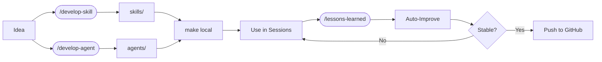
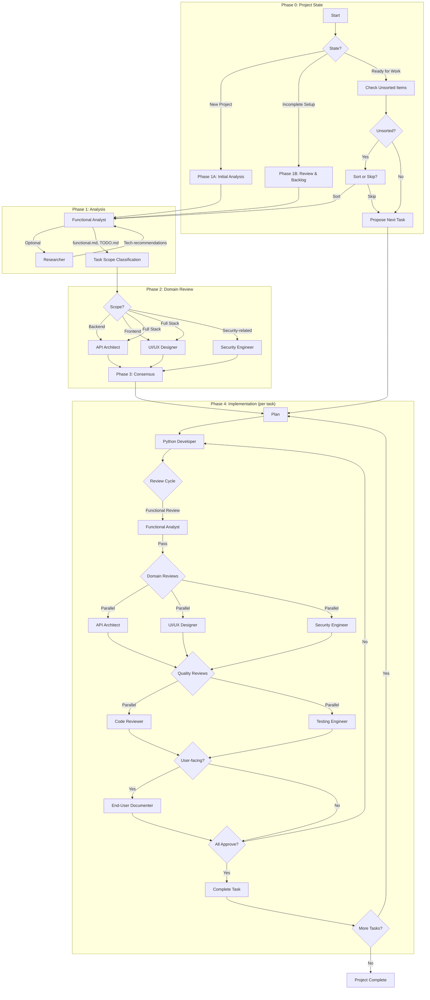

# C3 - Christophe’s Agentic Collective

[][python]
[][uv]
[][license]
[](https://christophe.vg/about/Agentic-Workflow)

> C3, short for Christophe Agentic Collective, is a personal collective of agents and skills designed for agentic coding and various other purposes. It originated as Christophe’s Coding Crew, which is how the name C3 came to be. Over time, it has undergone significant evolution and has now become known as Christophe’s Agentic Collective. The C3 name has remained consistent throughout its journey. 😉

> [!CAUTION]
> **Before installing any plugin**: Plugins can execute arbitrary commands on your machine. Always review a plugin's code before installing it.

> [!WARNING]  
> This is **my personal collective**. It is in constant flux. I try to keep the plugin version stable and usable, but **YMMV** 😇

## Philosophy

My agentic workflow is built on a simple belief: **create small automation steps, use them, and iteratively improve**. Each skill and agent emerged from real needs, was refined through use, and continues to evolve.

### The Skill Evolution Cycle


```mermaid
flowchart LR
    A[Idea] --> B(["/develop-skill"])
    A --> C(["/develop-agent"])
    B --> D[skills/]
    C --> E[agents/]
    D --> F["make local"]
    E --> F
    F --> G[Use in Sessions]
    G --> H(["/lessons-learned"])
    H --> I[Auto-Improve]
    I --> J{Stable?}
    J -->|No| G
    J -->|Yes| K[Push to GitHub]
```

- **Create**: Use `/develop-skill` or `/develop-agent` to design new skills/agents
- **Test locally**: `make local` runs with `--plugin-dir ./`
- **Use/Refine loop**: Use in sessions, run `/lessons-learned` to capture improvements
- **Distribute**: Push to GitHub when stable

---

## Installation

### As a Plugin (End Users)

Install from the christophe.vg marketplace:

```bash
# Add the marketplace
claude plugin marketplace add christophevg/marketplace

# Install C3
claude plugin install c3@christophe.vg
```

Skills and agents are namespaced (e.g., `/c3:python`, `/c3:commit`).

### Local Development

To develop or test the latest version locally:

```bash
# Clone the repository
git clone https://github.com/christophevg/c3.git
cd c3
make install
```

> [!NOTE]  
> `make install` copies `Makefile.clause` to your personal `~/.claude` folder and allows your project Makefiles to include it using `-include ~/.claude/Makefile`. Now you can use several utility targets to work with claude and use C3 as a harness configuration. For example `make` basically runs Claude Code using Ollama. If you do this from the C3 folder, it will also include that folder as a plugin.

---

## Skills (54)

Skills provide focused guidance for specific technologies and workflows.

### Plugin & MCP Development (2)

| Skill | Description |
|-------|-------------|
| `/mcp-server` | Guide for designing and building MCP servers (FastMCP, security, deployment). |
| `/plugin-development` | Guide for creating Claude Code plugins (structure, manifest, distribution). |

### Project Management (7)

| Skill | Description |
|-------|-------------|
| `/project` | Dispatcher for project management skills. |
| `/project-feature` | Capture and scope new features with MBI support. |
| `/project-manage` | Full implementation workflow with specialized agents. |
| `/project-status` | Generate STATUS.md with executive summary, metrics, dependencies, blockers, risks. |
| `/project-todo-refine` | Iteratively refine TODO.md topics by reviewing state, scope, and priority. |
| `/project-migrate` | Migrate projects between versions or frameworks. |
| `/website-manage` | Manage content websites with conversational workflow. No PRs, no agents. |

### Planning & Prioritization (3)

| Skill | Description |
|-------|-------------|
| `/plan` | Structured feature planning with PLAN.md templates. |
| `/wsjf` | Interactive WSJF (Weighted Shortest Job First) scoring for prioritization. |
| `/bug-hunting` | Systematic debugging with patterns, templates, and integration guides. |

### Personal Assistant (4)

| Skill | Description |
|-------|-------------|
| `/pa` | Main dispatcher for personal assistant workflow. |
| `/pa-inbox` | Process inbox files into actionable TODOs. |
| `/pa-session` | Manage session state for workflow continuity. |
| `/pa-outbox` | Generate formatted replies and manage archive. |

### Domain Expertise (9)

| Skill | Description |
|-------|-------------|
| `/python` | Python coding standards, tight code philosophy, and testing patterns. |
| `/pymongo` | MongoDB/PyMongo patterns and security. |
| `/baseweb` | Baseweb/Vue/Vuetify best practices. |
| `/fire` | Python Fire CLI patterns. |
| `/textual` | Textual TUI framework. |
| `/rich` | Rich console output. |
| `/vuetify-v1` | Vuetify 1.5 components in legacy Baseweb projects. |
| `/vuetify-v2` | Vuetify V2 components in Baseweb projects. |
| `/vuetify-v3` | Vuetify V3 components with comprehensive patterns and migration guide from V2. |

### Development (2)

| Skill | Description |
|-------|-------------|
| `/develop-skill` | Create and refine Claude Code skills. |
| `/develop-agent` | Develop Claude Code agents. |

### Utility (21)

| Skill | Description |
|-------|-------------|
| `/commit` | Git commits with atomic commits and conventional format. |
| `/bug-fixing` | Systematic bug fixing with TDD. |
| `/git-activity-report` | Human-readable git activity summaries. |
| `/git-scripting` | Safe git command usage in scripts. |
| `/naming` | Choose names for projects, products, agents. |
| `/analysis-integration` | Integrate findings from multiple agents. |
| `/lessons-learned` | Review session to improve skills/agents. |
| `/documentation` | Sphinx/readthedocs setup. |
| `/markdown-to-pdf` | Convert Markdown to PDF with TOC. |
| `/readme` | Create and maintain README files. |
| `/transcribe-session` | Curated session transcripts. |
| `/api2mod` | Convert API docs to Python modules. |
| `/spec2mod` | Generate Python from OpenAPI specs. |
| `/vue-form-generator` | Schema-based Vue.js forms. |
| `/ollama` | Python ollama library for LLM integration. |
| `/pyenv` | Manage Python versions. |
| `/pypi-publish` | Publish packages to PyPI. |
| `/mcp-tools` | Work with MCP tools: discovery, naming, sub-agent config. |
| `/release` | Release workflow and version management. |
| `/github` | GitHub operations and PR management. |
| `/research` | Comprehensive research with provenance tracking and source citations. |

### Framework-Specific (6)

| Skill | Description |
|-------|-------------|
| `/vue` | Vue.js framework patterns. |
| `/vuetify-v4` | Vuetify V4 components and patterns. |
| `/quart-webapp` | Quart web application patterns. |
| `/python-project` | Python project setup with uv. |
| `/copy-writer` | Content writing and copy editing. |
| `/prepare-for-exam` | Interactive study material generation. |

---

## Agents (16)

| Agent | Description |
|-------|-------------|
| `assistant` | Personal assistant for inbox processing and workflow coordination. |
| `project-manager` | Project workflow orchestration with multi-task execution. |
| `git-manager` | Git operations via c3:commit skill. |
| `functional-analyst` | Requirements extraction, task planning, and MBI intake. |
| `business-analyst` | Business requirements documents and stakeholder analysis. |
| `researcher` | Comprehensive research with provenance tracking. |
| `api-architect` | API design and architecture. |
| `ui-ux-designer` | User experience and interface design. |
| `python-developer` | Python implementation with tight code philosophy. |
| `code-reviewer` | Code quality review with tight code checklist. |
| `testing-engineer` | Test planning and coverage with tight tests philosophy. |
| `security-engineer` | Security vulnerability assessment. |
| `end-user-documenter` | End-user documentation generation. |
| `knowledge-agent` | Knowledge base querying and evolution. |
| `bug-fixer` | Bug fixing workflow with TDD approach. |
| `release-manager` | Release workflow and GitHub operations. |

---

## MCP Servers (1)

The plugin includes MCP servers that provide tools for Claude Code.

| Server | Tools | Description |
|--------|-------|-------------|
| `email` | 9 tools | Email exchange via IMAP/SMTP with security hardening |

### Email MCP Server

Tools: `list_accounts`, `list_folders`, `search_emails`, `get_email`, `download_attachment`, `send_email`, `reply_email`, `move_email`, `delete_email`

**Prerequisites**: [uv](https://docs.astral.sh/uv/) must be installed. The server uses `uv run` to automatically manage dependencies.

Configuration via environment variables:
```bash
export EMAIL_IMAP_HOST=imap.gmail.com
export EMAIL_SMTP_HOST=smtp.gmail.com
export EMAIL_USERNAME=your-email@gmail.com
export EMAIL_PASSWORD=your-app-password
```

Optional recipient whitelist:
```bash
export EMAIL_RECIPIENT_DOMAINS=example.com,company.org
```

---

## Project Management Workflow

The `/project` skill dispatcher handles one-off operations, while the `project-manager` agent orchestrates multi-task sessions with progress tracking and memory persistence.


```mermaid
flowchart TB
    subgraph Phase0["Phase 0: Project State"]
        A[Start] --> B{State?}
        B -->|New Project| C[Phase 1A: Initial Analysis]
        B -->|Incomplete Setup| D[Phase 1B: Review & Backlog]
        B -->|Ready for Work| E[Check Unsorted Items]
        E --> F{Unsorted?}
        F -->|Yes| G[Sort or Skip?]
        F -->|No| H[Propose Next Task]
    end

    subgraph Phase1["Phase 1: Analysis"]
        C --> I[Functional Analyst]
        D --> I
        I -->|Optional| J[Researcher]
        J -->|Tech recommendations| I
        I -->|functional.md, TODO.md| K[Task Scope Classification]
        G -->|Sort| I
        G -->|Skip| H
    end

    subgraph Phase2["Phase 2: Domain Review"]
        K --> L{Scope?}
        L -->|Backend| M[API Architect]
        L -->|Frontend| N[UI/UX Designer]
        L -->|Full Stack| M
        L -->|Full Stack| N
        L -->|Security-related| O[Security Engineer]
        M --> P[Phase 3: Consensus]
        N --> P
        O --> P
    end

    subgraph Phase4["Phase 4: Implementation (per task)"]
        H --> Q[Plan]
        Q --> R[Python Developer]
        R --> S{Review Cycle}
        S -->|Functional Review| T[Functional Analyst]
        T -->|Pass| U{Domain Reviews}
        U -->|Parallel| M2[API Architect]
        U -->|Parallel| N2[UI/UX Designer]
        U -->|Parallel| O2[Security Engineer]
        M2 --> V{Quality Reviews}
        N2 --> V
        O2 --> V
        V -->|Parallel| W[Code Reviewer]
        V -->|Parallel| X[Testing Engineer]
        W --> Y{User-facing?}
        X --> Y
        Y -->|Yes| Z[End-User Documenter]
        Y -->|No| AA{All Approve?}
        Z --> AA
        AA -->|No| R
        AA -->|Yes| AB[Complete Task]
        AB --> AC{More Tasks?}
    end

    P --> Q
    AC -->|Yes| Q
    AC -->|No| AD[Project Complete]
```

---

## Contributing

See [CONTRIBUTING.md](CONTRIBUTING.md) for guidelines.

## License

[MIT](LICENSE)

[python]: https://python.org/
[uv]: https://docs.astral.sh/uv/
[license]: LICENSE
