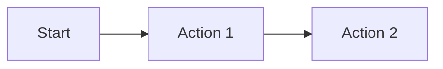
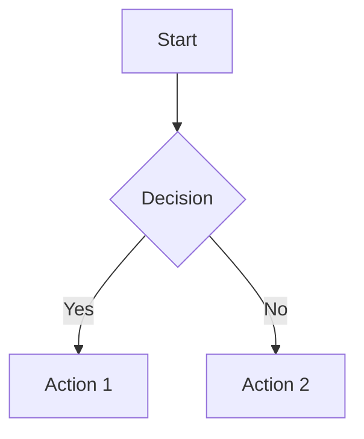

# Business Analyst Agent - Functional Analysis

**Date:** 2026-04-29
**Analyst:** develop-agent skill
**Status:** Ready for Implementation

## Purpose

The Business Analyst Agent bridges the gap between raw business ideas and structured technical requirements. It translates stakeholder vision into business artifacts (BRD, user journeys, process models) that the functional-analyst can then transform into technical specifications.

**Core Distinction from Functional Analyst:**

| Aspect | Business Analyst | Functional Analyst |
|--------|------------------|-------------------|
| **Focus** | Business understanding | Technical specifications |
| **Question** | "What problem? Who are users? What journeys?" | "How should system work? Technical specs?" |
| **Input** | Business idea/plan/case | Requirements, features |
| **Output** | BRD, user journeys, process models | Functional analysis, TODO |
| **Role** | Precedes functional analysis | Follows business analysis |

## Scope

### In Scope

- Analyzing business ideas, plans, and cases
- Identifying stakeholders and their roles
- Mapping business processes and workflows
- Creating user journey maps and user stories
- Defining domain models and business rules
- Producing Business Requirements Documents (BRD)
- Preparing input for functional-analyst agent

### Out of Scope

- Technical implementation decisions
- API design and data modeling
- Code generation or implementation
- Security architecture review
- Testing strategy

## Inputs

| Input | Type | Description |
|-------|------|-------------|
| Business idea | Document or description | Raw business concept or vision |
| Business plan | Document | Formal business plan with goals, market analysis |
| Business case | Document | Justification for a project or initiative |
| Project documentation | Any file | All files in the project repository are available sources |
| Stakeholder input | Conversation | Questions and answers about business context |

**Documentation Priority Order:**
1. `idea.md` — for ideas, incubator projects
2. `plan.md` — for business plans
3. `README.md` — for standard projects
4. `TODO.md` — for backlog and planned features
5. `analysis/` — existing analysis documents
6. Any other documentation in the project repository

## Outputs

| Output | Type | Location |
|--------|------|----------|
| BRD | Markdown | `{root}/analysis/business-requirements.md` |
| User journeys | Markdown | `{root}/analysis/user-journeys.md` |
| Process models | Markdown | `{root}/analysis/process-models.md` |
| Domain model | Markdown | `{root}/analysis/domain-model.md` |
| Stakeholder analysis | Markdown | `{root}/analysis/stakeholders.md` |

## Tools Required

| Tool | Usage | Risk Level |
|------|-------|------------|
| Read | Read existing documents, research | read |
| Grep | Search for patterns in documentation | read |
| Glob | Find related documents | read |
| Write | Create analysis documents | modify |
| Edit | Update existing documents | modify |
| WebSearch | Research best practices, templates | read |
| WebFetch | Retrieve reference materials | read |

## Constraints

- **No implementation decisions**: Business analysis only, technical decisions deferred to functional-analyst
- **No code generation**: Produces documents, not code
- **No TODO creation**: That's functional-analyst's responsibility
- **Interview-driven**: Must ask clarifying questions before producing artifacts
- **Template-based**: Uses standard business analysis templates

## Workflow

### 1. Discovery Phase

1. Read available business documentation (idea.md, README.md, or user-provided documents)
2. Identify gaps in business understanding
3. Prepare interview questions
4. Ask user for clarification

### 2. Analysis Phase

1. Document stakeholders and their roles
2. Map business processes and workflows
3. Identify business rules and constraints
4. Create user journey maps
5. Define domain model elements

### 3. Documentation Phase

1. Create Business Requirements Document (BRD)
2. Document user journeys and stories
3. Create process flow diagrams (Mermaid)
4. Define stakeholder analysis
5. Summarize for functional-analyst handoff

## Example Scenarios

### Scenario 1: New Product Idea

**Input:** "I want to build a marketplace for local artisans to sell handmade goods"

**Expected Output:**
- Stakeholders: Artisans, Buyers, Platform Owner, Payment Processor
- User Journeys: Artisan onboarding, Product listing, Buyer discovery, Checkout
- Process Models: Order fulfillment, Payment flow, Dispute resolution
- Domain Model: Product, Order, User, Transaction, Review

### Scenario 2: Business Case Analysis

**Input:** "We need to reduce customer churn by 20% through a loyalty program"

**Expected Output:**
- Stakeholders: Customers, Marketing Team, Customer Success, Finance
- User Journeys: Enrollment, Points earning, Redemption, Tier progression
- Process Models: Points calculation, Reward fulfillment, Tier upgrade
- Domain Model: Customer, Points, Reward, Tier, Transaction

## Decisions Made

| Decision | Rationale |
|----------|-----------|
| Separate from functional-analyst | Different focus (business vs technical), different outputs |
| Interview-driven workflow | Business analysis requires clarification |
| Template-based outputs | Consistency and completeness |
| analysis/ folder location | Aligns with existing C3 conventions |

## Related Agents

- **functional-analyst** — Consumes Business Analyst outputs to create technical specifications
- **researcher** — May be invoked to research business domain patterns
- **project-manager** — Coordinates workflow between Business Analyst and other agents

## Scope Validation

- **Trigger Test**: ✓ Single trigger: "When user provides a business idea/plan/case to analyze"
- **Action Test**: ✓ Single output type: Business analysis artifacts (BRD, journeys, process models)
- **Failure Test**: ✓ Contained failure: If analysis fails, report issue and ask for clarification

## Artifact Templates

### Business Requirements Document (BRD) Template

```markdown
# Business Requirements Document

## Executive Summary
[2-3 sentence overview]

## Business Context
- Problem Statement
- Business Objectives
- Success Criteria

## Stakeholders
| Stakeholder | Role | Interest | Influence |
|-------------|------|----------|-----------|

## Business Requirements
### Must Have
- [requirement 1]
- [requirement 2]

### Should Have
- [requirement 1]

### Could Have
- [requirement 1]

## Business Rules
- [rule 1]
- [rule 2]

## Assumptions
- [assumption 1]

## Constraints
- [constraint 1]
```

### User Journey Template

```markdown
# User Journey: [Journey Name]

## User Persona
[Description of the user type]

## Journey Stages

### Stage 1: [Name]
- **User Action**: ...
- **System Response**: ...
- **Pain Points**: ...
- **Opportunities**: ...

### Stage 2: [Name]
...

## Journey Map (Mermaid)


## Success Metrics
- [metric 1]
```

### Process Model Template

```markdown
# Process: [Process Name]

## Overview
[2-3 sentence description]

## Participants
| Role | Responsibility |
|------|---------------|

## Process Flow (Mermaid)


## Business Rules
- [rule 1]
- [rule 2]

## Exceptions
- [exception 1]
```

## Handoff to Functional Analyst

The Business Analyst produces artifacts that the Functional Analyst consumes:

```
Business Case → Business Analyst
                      ↓
              BRD, User Journeys, Process Models
                      ↓
              Functional Analyst
                      ↓
              Technical Specs, TODO, Acceptance Criteria
                      ↓
              Development Agents
```

## Project-Manager Workflow Integration

The Business Analyst is integrated into the project-manager workflow as follows:

### Phase 1A-Business: Initial Business Analysis (New Project)

When business analysis artifacts are missing AND the project involves business requirements:

1. **Check project type:**
   - Pure technical projects (refactoring, bug fixes, performance optimization) → Skip business analysis
   - Business-driven projects (new features, products, initiatives) → Offer business analysis

2. **If business analysis may be beneficial:**
   Ask user: "This project may benefit from business analysis (BRD, user journeys, process models). Would you like me to produce these before functional analysis?"

3. **If user accepts:**
   - Invoke c3:business-analyst agent
   - Wait for completion
   - Proceed to Phase 1A-Functional

4. **If user declines:**
   - Create placeholder: `analysis/business-analysis-skipped.md`
   - Content: "Business analysis was skipped for this project on {date}."
   - Proceed to Phase 1A-Functional

### When NOT to Offer Business Analysis

Skip business analysis offer when:
- Pure technical projects (refactoring, bug fixes, performance optimization)
- Infrastructure or tooling projects
- Projects with complete business documentation already

### Review Cycle

The Business Analyst is **NOT** automatically part of the review cycle. The functional-analyst review is sufficient.

Run business analysis review manually when:
- Business requirements change
- User journeys need validation
- Stakeholder analysis needs update

## Acceptance Criteria

- [ ] Agent definition created with clear scope and templates
- [ ] Five-section system prompt framework applied
- [ ] Distinction from functional-analyst clearly documented
- [ ] Template artifacts defined for BRD, user journeys, process models
- [ ] Interview workflow defined for requirements clarification
- [ ] Output format specified for all artifacts